# Sea battle game
Наш проект - унікальна онлайн гра, яка дозволяє понуритися до екшн боїв між парусниками та пароходами. Цей проект був створеним задля нового погляду на стару гру в яку ви ще могли грати дітлахами, удосконалену цікавим функціоналом.
Наша гра включає в себе:
- унікальний гейплей
- великий арсенал зброї 
- Дивовижні спрайти
- елегантний супровід легендарних треків 20-го століття
- приголомшливу графіку
- хитромудрі ачівки та винагороди


### DIFFERENT INFORMATION 

- [How use it on Windows](#how-use-it-on-windows)

- [How use it on Linux or MAC](#how-use-it-on-linux-or-mac)

- [Our project structure](#our-project-structure)

- [Information about our team](#information-about-our-team)

- [Support team](#support-team)

- [Technologies and languages we used](#technologies-and-languages-we-used)

- [Modules used](#modules-used)

- [Game functional](#game-functional)

- [Armory functional](#armory-functional)

- [Credits](#credits)


# How use it on Windows:
1. enter git bash

2. git clone https://github.com/TymofiiZelenyi/Sea_battle_game.git

2. python -m venv venv

3. venv/Scripts/activate

4. choose your activated virtual enviroment
 
5. pip install -r requirements.txt

6. Launch main.py 

- [BACK](#different-information)
# How use it on Linux or MAC:
1. enter bash

2. git clone https://github.com/TymofiiZelenyi/Sea_battle_game.git

2. python3 -m venv venv

3. venv/Bin/activate

4. choose your activated virtual enviroment
 
5. pip install -r requirements.txt

6. Launch main.py 

- [BACK](#different-information)
---

# Our project structure

```mermaid
graph TD
    A[Sea-Battle-Game] --> B[fonts] --> 1(just archive with fonts that we are using)
    A[Sea-Battle-Game] --> C[image] --> 2(just archive with images that we are using)
    A[Sea-Battle-Game] --> D[Modules] --> E[game]
   
    D[Modules] --> F[server.py]
    
    E[game] --> 7(mechanics and diffrent windows)
    E[game] --> I[armory.py] --> 8(contains all info about our special powers such as price, name, radius...)
    E[game] --> J[battle.py] --> 9(contains all mechanics that working only when you battling your opponent)
    E[game] --> K[map.py] --> 10(saves variant of placing your ships. cannot be saved for more than one time!)
    E[game] --> L[menu.py] --> 11(contains that screen that you see when entering the game)
    E[game] --> M[placement.py] --> 12(contains screen where you place your ships)
    E[game] --> N[wait_opponent.py] --> 13(contains screen where you can choose join or create_server)
    E[game] --> S[settings_real.py] --> 30(contains window settings. You can go there by choosing button settings in menu. Also you can change bg music, cursor and volume)
    E[game] --> O[basement]
    O[basement] --> 14[bg_music.py] --> 22(contains function that playing backgound music. you can choos)
    O[basement] --> 15[button.py] --> 23(contains two classes, one of them can create text by using class Text and the other one is Button that creates a presseable button)
    O[basement] --> 16[read_json.py] --> 24(contains simple function that reads json and returns dict)
    O[basement] --> 17[screen.py] --> 25(contains object screen)
    O[basement] --> 18[ships.py] --> 26(contains big class Ships that creates ships!)
    O[basement] --> 19[skills.py] --> 27(contains class Skills that creates skills)
    O[basement] --> 20[write_json.py] --> 28(contains a simple function that write some data to json)
    E[game] --> 31[settings.json] --> 32(contains all of our global settings)
    
    A[Sea-Battle-Game] --> H[sound] --> 5(contains sounds)
    A[Sea-Battle-Game] --> 35[requirements.txt] --> 36(you need to install all of this modules to be able to play this game)


```


---

# Information about our team

1. Github - [Tymofii](https://github.com/TymofiiZelenyi)
2. Github - [Egor](https://github.com/Egor1586)
3. Github - [Ivan](https://github.com/IvanovIvaan)
4. Github - [Ratmir](https://github.com/ratmir-svg)

- [BACK](#different-information)

# Support team:
- Telegram --> @Big_Floooopa
- Telegram --> @Egor115819
- Telegram --> @IvanoBudda

Support our team(pls) --> place your cvv here!

- [BACK](#different-information)
# Technologies and languages we used
1. >Python - We used Python for rapid development of our game.
2. >Figma - We used Figma for creating the design of our game.   


- [BACK](#different-information)
# Figma of the project

- [Figma](https://www.figma.com/design/joBvMYOgpufLtGiCqvJnJt/Untitled?node-id=0-1&t=JThopTyiUqR1RWHE-1)
- [Figjam](https://www.figma.com/board/tlhJvV4adRfLPIy0UZ9NUE/Untitled?node-id=1-5&t=6B7FpF1CBX8vuU7X-1)

- [BACK](#different-information)
# Modules used

- pygame - це бібліотека для розробки ігор  на Python. Вона надає прості у використанні інтерфейси для керування графікою, звуком і подіями, що спрощує створення інтерактивних додатків та ігор.
- socket - це модуль, який надає доступ до мережевих інтерфейсів. Він використовується для створення мережевих з'єднань (наприклад, клієнт-сервер), дозволяючи передавати дані через мережу з використанням різних протоколів, таких як TCP та UDP.
- io - це модуль, який надає інструменти для роботи з потоками вводу-виводу. Він підтримує різні типи потоків, включаючи текстові та бінарні потоки, що робить його корисним для роботи з файлами та вводу/виводу даних.
- os - модуль, що надає функції для взаємодії з операційною системою. Він дозволяє виконувати завдання, такі як робота з файловою системою, управління процесами та отримання інформації про середовище виконання.
- pillow - це бібліотека для обробки зображень у Python. Вона підтримує безліч форматів зображень і надає функції для їх обробки, включаючи зміну розмірів, обрізання, накладання текстів та фільтри.
- Threads - це модуль, що підтримує багатопоточність, дозволяючи виконувати кілька операцій одночасно в одному процесі. Він корисний для завдань, які можуть виконуватися паралельно, таких як завантаження даних або обробка дій користувача.

- [BACK](#different-information)

# Game functional:
- [BACK](#different-information)
При відкриті програми для користувача випливає головне вікно "МЕНЮ", у якому є можливість вибору між кнопками:
- [PLAY](#button-play)
- [ARMORY](#armory-functional)
- [SETTINGS](#button-settings)
- [QUIT](#button-quit)


# button play
Кнопка "PLAY":
- Натиснувши на дану кнопку, гравець переходить на наступний етап гри - вікно розташування кораблів. 

```python
    class Ships():
        def __init__ (self, x: int, y: int, count_length: int, id : int):
            self.x = x
            self.y = y
            self.start_x = x
            self.start_y = y
            
            self.count_length = count_length
            self.ID = id
            self.COLOR = '#E7C500'

            self.WHERE = False

            self.row = 0
            self.cell = 0

            self.DIR = True
            self.LAST_DIR = True
            self.MOVE = False
            self.TAKE = False
            # self.PLACE = True

            self.STAY = False
            
            self.rect = pygame.Rect(self.x, self.y, 60* self.count_length, 60 )

            self.load()

        def search_abs_path(self, DIR):
            path = os.path.abspath(os.path.join(os.path.join(__file__, "..", "..", "..", "..", "image", "ship", f"{self.count_length}-SHIP-{DIR}.png")))
            return path

        def load(self):
            self.image_t = pygame.image.load(self.search_abs_path(True))
            self.image_t = pygame.transform.scale(self.image_t, [60 * self.count_length, 60])

            self.image_f = pygame.image.load(self.search_abs_path(False))
            self.image_f = pygame.transform.scale(self.image_f, [60, 60 * self.count_length])

```

За малювання кораблів відповідає мотод ship_draw():

```python          
    def ship_draw(self, screen):
        if self.DIR:
            self.rect = pygame.Rect(self.x, self.y, 60* self.count_length, 60 )
            # self.sur = pygame.Surface(( 60* self.count_length, 60 ))
            # screen.blit(self.sur, (self.x, self.y)) 
            #HITBOX
            screen.blit(self.image_t, (self.x, self.y))

        elif not self.DIR:
            self.rect = pygame.Rect(self.x, self.y, 60, 60 * self.count_length)
            # self.sur = pygame.Surface((60, 60 * self.count_length))
            # screen.blit(self.sur, (self.x, self.y))
            #HITBOX
            screen.blit(self.image_f, (self.x, self.y))     
```
    
Метод take_ship() відповідає за перевірку того, чи взятий кораблик, якщо так то метод move() починає малювати актуальною позицію. Вихищає її за допомогою координат миші:

```python     
    def take_ship(self, position):
        if self.rect.collidepoint(position) and all(ship.TAKE == False for ship in ship_list):   
            if not self.MOVE and big_sq.collidepoint(position):
                self.WHERE = True
            elif not self.MOVE and small_sq .collidepoint(position):
                self.WHERE = False
            self.TAKE = True

    def move(self, position, press, screen):
        if press[0] and self.DIR and self.TAKE:
            self.x = position[0] - 30
            self.y = position[1] - 30
            self.MOVE = True
            self.rect = pygame.Rect(self.x- 30, self.y-30, 60* self.count_length+60, 120 )
            # self.sur = pygame.Surface((60* self.count_length+60, 120 ))
            # screen.blit(self.sur, (self.x -30, self.y-30))
            #HITBOX
            screen.blit(self.image_t, (self.x, self.y))

        elif press[0] and not self.DIR and self.TAKE:
            self.x = position[0] - 30
            self.y = position[1] - 30
            self.rect = pygame.Rect(self.x-30, self.y-30, 120, (60 * self.count_length)+60)
            # self.sur = pygame.Surface((120, 60 * self.count_length+60))
            # screen.blit(self.sur, (self.x -30, self.y-30))
            #HITBOX
            screen.blit(self.image_f, (self.x, self.y))
            self.MOVE = True
        else:
            self.MOVE = False  
            self.TAKE = False
```
    
Створення 10 кораблів за допомогою класу:

```python             
    ship1 = Ships(x = 856, y = 162, count_length = 1, id= 0)
    ship2 = Ships(x = 936, y = 162, count_length = 1, id= 1)
    ship3 = Ships(x = 1016, y = 162, count_length = 1, id= 2)
    ship4 = Ships(x = 1096, y = 162, count_length = 1, id= 3)

    ship5 = Ships(x = 856, y = 242, count_length = 2, id= 4)
    ship6 = Ships(x = 996, y = 242, count_length = 2, id= 5)
    ship7 = Ships(x = 1136, y = 242, count_length = 2, id= 6)

    ship8 = Ships(x = 856, y = 322, count_length = 3, id= 7)
    ship9 = Ships(x = 1056, y = 322, count_length = 3, id= 8)

    ship10 = Ships(x = 856, y = 402, count_length = 4, id= 9)

    ship_list = [ship1, ship2, ship3, ship4, ship5, ship6, ship7, ship8, ship9, ship10]

```

- [BACK](#different-information)
    
Після вибору будь якої з пропонованих клавішей, гравцю надається доступ до наступного вікна, яке відповідає за розташування власних кораблів на 2D полі розмірами 10*10 одиниць.


На вибір для розташування гравцю надаються 10 кораблів:

- Чотири однопалубних коралів, розмірами в 1 клітини


- Два двопалубних коралів, розмірами в 2 клітини


- Два трипалубних коралів, розмірами в 3 клітини


- Один чотирипалубних корабель, розмірами в 4 клітини


Користувач може розташовувати кораблі в різних напрямках (по горизонталі - за замовчуванням / по вертикалі - взявши корабель й натиснувши праву клавішу миши)
Користувач НЕ може ставити повністю, або частично свої кораблі за кордонами обмеженого поля.

Ця перевірка відповідає за запам'ятовування останньої координати коли корабель був узятий з поля.

```python
for event in pygame.event.get():            
    if not press[1] and not press[2] and event.type == pygame.MOUSEBUTTONDOWN:
        print("TAKE")  
        number = 0
        for item in row_list:
            for ship in ship_list:
                cell = number % 10
                row = number // 10 
                ship.take_ship(position= position)
                
                if item.collidepoint(position) and ship.WHERE and last:
                    last_cell = cell
                    last_row = row
                    last = False
                else:
                    last = True
            number += 1
```   

Після того як ми запам'ятали координати, залежно від розміру і положення коробля, скидаємо матрицю на порожні клітини звільняючи місце для інших кораблів.
    
```python
    if event.type == pygame.MOUSEBUTTONDOWN and not press[1] and not press[2]:
        number = 0
        for item in row_list:
            for ship in ship_list:
                cell = number % 10
                row = number // 10 
                
                if ship.rect.collidepoint(position) and ship.WHERE and last:
                    if ship.count_length == 1:
                        player_map1[last_row][last_cell] = 0
                    if ship.count_length != 1 and ship.DIR:
                        for i in range(ship.count_length):
                            if last_cell + i < 10:
                                player_map1[last_row][last_cell+i] = 0
                    if ship.count_length != 1 and not ship.DIR:
                        for i in range(ship.count_length):
                            if last_row + i < 10:
                                player_map1[last_row+i][last_cell] = 0
            number += 1
```

Наступний блок коду відповідає за розтановку кораблів.

Також перед тим як поставити кораблик на поле за допомогою функції check() ми перевіряємо чи не стоять кораблі надто близько один одному.

```python 
    def check(ID, rect):
            for ship in ship_list:
                if ship.ID != ID:  # не проверяем столкновение с самим собой
                    if rect.colliderect(ship.rect):
                        return False

            else:
                return True
```

Коли перевірку пройдено ми можемо перейти до того щоб привласнити кораблю свою клітину якщо, він стоїть у межах поля і має вільні клітини
    
```python 
    if event.type == pygame.MOUSEBUTTONUP and not press[1] and not press[2]:            
        number = 0
        for item in row_list:
            for ship in ship_list:
                if item.collidepoint(position) and ship.MOVE and sq_list[0].collidepoint(position):
                    cell = number % 10
                    row = number // 10               
                    #перевірка кораблів та клітинок при горизонтальному положенні кораблика.
                    if ship.DIR and cell + ship.count_length <= 10 and all(player_map1[row][cell + i] == 0 for i in range(ship.count_length)) and not ship.WHERE:
                        place = check(ship.ID, ship.rect)
                        if place:
                            ship.STAY = True 
                            ship.x = item.x
                            ship.y = item.y
                            for i in range(ship.count_length):
                                player_map1[row][cell+i] = 1
                                print(player_map1[row][cell+i])  
                        else:
                            ship.STAY = False 
                            ship.DIR =  True
                            ship.x = ship.start_x
                            ship.y = ship.start_y                  
                    elif ship.DIR and cell + ship.count_length <= 10 and all(player_map1[row][cell + i] == 0 for i in range(ship.count_length)) and ship.WHERE:
                        place = check(ship.ID, ship.rect)
                        if place:
                            ship.STAY = True
                            ship.x = item.x
                            ship.y = item.y
                            for i in range(ship.count_length):
                                player_map1[row][cell+i] = 1
                        else:
                            ship.STAY = False 
                            ship.DIR =  True
                            ship.x = ship.start_x
                            ship.y = ship.start_y
                    elif ship.DIR and cell + ship.count_length <= 10 and any(player_map1[row][cell + i] == 1 for i in range(ship.count_length)) and not ship.WHERE: 
                        ship.STAY = False 
                        ship.DIR =  True
                        ship.x = ship.start_x
                        ship.y = ship.start_y 
                    elif ship.DIR and cell + ship.count_length <= 10 and any(player_map1[row][cell + i] == 1 for i in range(ship.count_length)) and ship.WHERE:  
                        ship.STAY = False                 
                        ship.DIR =  True
                        ship.x = ship.start_x
                        ship.y = ship.start_y                   
                                         
                    #умова, при якій кораблик повертається на стартові координати, якщо кораблик виходить за рамки поля.
                    elif ship.DIR and cell + ship.count_length > 10 and not ship.WHERE: 
                        ship.STAY = False                    
                        ship.DIR =  True
                        ship.x = ship.start_x
                        ship.y = ship.start_y
                        
                    
                    elif ship.DIR and cell + ship.count_length > 10 and  ship.WHERE:
                        ship.STAY = False 
                        ship.DIR =  True
                        ship.x = ship.start_x
                        ship.y = ship.start_y
                    #перевірка кораблів та клітинок при горизонтальному положенні кораблика.
                    if not ship.DIR and row + ship.count_length <= 10 and all(player_map1[row + i][cell] == 0 for i in range(ship.count_length)) and not ship.WHERE:
                        place = check(ship.ID, ship.rect)
                        if place:
                            ship.STAY = True
                            ship.x = item.x
                            ship.y = item.y
                            for i in range(ship.count_length):
                                player_map1[row+i][cell] = 1  
                        else:
                            ship.STAY = False 
                            ship.DIR =  True
                            ship.x = ship.start_x
                            ship.y = ship.start_y 
                    elif not ship.DIR and row + ship.count_length <= 10 and all(player_map1[row + i][cell] == 0 for i in range(ship.count_length)) and ship.WHERE:
                        place = check(ship.ID, ship.rect)
                        if place:
                            ship.STAY = True
                            ship.x = item.x
                            ship.y = item.y
                            for i in range(ship.count_length):
                                player_map1[row+i][cell] = 1
                        else:
                            ship.STAY = False 
                            ship.DIR =  True
                            ship.x = ship.start_x
                            ship.y = ship.start_y
                    elif not ship.DIR and row + ship.count_length <= 10 and any(player_map1[row + i][cell] == 1 for i in range(ship.count_length)) and not ship.WHERE: 
                        ship.STAY = False 
                        ship.DIR =  True
                        ship.x = ship.start_x
                        ship.y = ship.start_y 
                    elif not ship.DIR and row + ship.count_length <= 10 and any(player_map1[row+1][cell] == 1 for i in range(ship.count_length)) and ship.WHERE: 
                        ship.STAY = False                    
                        ship.DIR =  True
                        ship.x = ship.start_x
                        ship.y = ship.start_y                   
                                         
                    #умова, при якій кораблик повертається на стартові координати, якщо кораблик виходить за рамки поля.
                    elif not ship.DIR and row + ship.count_length > 10 and not ship.WHERE:
                        ship.STAY = False                       
                        ship.DIR =  True
                        ship.x = ship.start_x
                        ship.y = ship.start_y
                        
                    
                    elif not ship.DIR and row + ship.count_length > 10 and ship.WHERE:
                        ship.STAY = False                      
                        ship.DIR =  True
                        ship.x = ship.start_x
                        ship.y = ship.start_y
                                                    
                #умова, при якій наший кораблик повертається на стартові координати, якщо його ставлять за рамками поля.
                elif ship.MOVE and not sq_list[0].collidepoint(position) and not press[2]:
                    ship.STAY = False       
                    ship.DIR =  True
                    ship.x = ship.start_x
                    ship.y = ship.start_y
                
            number += 1
```
    
Для того щоб повернути кораблик потрібно натиснути праву кнопку миші, коли ви його переміщаєте на його місце.
У коді це відбувається за допомогою даної провірки в якії при виконанні умов змінює положення коробля на протилежне.
    
```python
    if event.type == pygame.MOUSEBUTTONDOWN and not press[1] and not press[2]:
        for ship in ship_list:
            if ship.MOVE:
                ship.LAST_DIR = ship.DIR
                ship.DIR = not ship.DIR  
```

Щоб перейди на льодове поле треба, щоб усі кораблі стояли на полі. Це ми робимо за допомогою генератора котрий перевіряє параметр корабля ship.STAY.
    
```python
    if press[0]:
        button_ready_window = button_ready.checkPress(position = position, press = press)
        if button_ready_window and all(ship.STAY for ship in ship_list):
            res = wait_opponent()
    
            if res == "BACK":
                return "HOME"     
```

Після розтановки ВСІХ кораблей гравцю надається можливість перейти до етапу пошуку битви за клавішою "READY".

Вікно приєднання до онлайн гри з іншим користувачем. У даному вікні присутні дві подальші кнопки "CREATE SERVER" та "JOIN"

З ліва показується ваш поточний LAN
З права вам треба ввести LAN к котрому ви хочете підключитися
Та потім вам потрібно натиснути кнопку Join


    
"CREATE SERVER" відповідає за створення власного серверу за допомогою LAN Ip адесси.

```python
    def start_server():  
        # створили socket для передачи даних вказавши версію IP TCP тип з'єднання 
        with socket.socket(family = socket.AF_INET, type = socket.SOCK_STREAM) as server_socket: 
            # зв'язуємо socket з IP та портом 
            server_socket.bind(("localhost", 8081)) #той айпішнік, який не дома у Тимофія 

            server_socket.listen(2) 

            try:
                client_socket1, adress1 = server_socket.accept() 
                print(client_socket1, adress1) 
            except socket.timeout:
                print("TIMEOUT 1")
                return
    

            try:
                client_socket2, adress2 = server_socket.accept() 
                print(client_socket2, adress2) 
            except socket.timeout:
                print("TIMEOUT 2")
                return
    
            data1 = client_socket1.recv(4096)  # Преобразуем байты в строку 
            client_socket2.sendall(data1) 
    
            data2 = client_socket2.recv(4096)  # Преобразуем байты в строку 
            client_socket1.sendall(data2) 
    
            number = int(random.randint(0, 1)) 
            print(number) 
            if not number: 
                print("first 1") 
                client_socket1.sendall("you".encode()) 
                client_socket2.sendall("not".encode()) 
            elif number: 
                print("first 2") 
                client_socket1.sendall("not".encode()) 
                client_socket2.sendall("you".encode()) 
    
            print(number) 
    
            while True:   
                if number == 1: 
                    shot2 = client_socket2.recv(35).decode() 
    
                    shot2 = shot2.strip("[]") 
                    shot2 = [int(num) for num in shot2.split(",")] 
                    number = bool(shot2[4]) 
                    number = not number 
                    number = int(number) 
                    shot2 = ",".join(map(str, shot2)) 
    
                    client_socket1.sendall(shot2.encode()) 
                    
                elif number == 0: 
                    shot1 = client_socket1.recv(35).decode() 
    
                    shot1 = shot1.strip("[]") 
                    shot1 = [int(num) for num in shot1.split(",")] 
                    number = int(shot1[4]) 
                    shot1 = ",".join(map(str, shot1)) 
    
                    client_socket2.sendall(shot1.encode())  

            server_thread = Thread(target = start_server)
                    
```

"JOIN" - допомагає приєднатися до існуючого серверу.
 
```python
    def connect_to():
            '''
            Пiд'єднується до сервера
            '''
            client_socket.connect(("localhost", 8081))
            print("connect")
```
    
Пересилання даних відбувається за допомогою функції sending().

```python
    def sending(row: int, cell: int, number: int, shot_type: int, turn: bool, kill_type: int, skill = 0) -> None :
        '''
        Запаковує всі дані у `data` та відправляє на сервер
        '''
        data = [row, cell, number, shot_type, turn, kill_type, skill]
        print(data)
        data = json.dumps(data)
        client_socket.sendall(data.encode())

        print("sending")

```

Обробка інформації відбувається за допомогою другого потоку always_recv()
    
```python
    def always_recv():
        global turn
        global run_battle
        global stop_thread

        while stop_thread:
            data = client_socket.recv(35).decode()
            if data:
                data = data.strip("[]")
                data = [int(num) for num in data.split(",")]

                c_row = int(data[0])
                c_cell = int(data[1])
                c_number = int(data[2])
                c_type = int(data[3])
                turn = int(data[4])
                kill_type = int(data[5])
                skill = int(data[6])

                if skill == 1:                       
                    bomb_list= [(c_row, c_cell), (c_row, c_cell- 1), (c_row, c_cell+ 1), (c_row- 1, c_cell), (c_row+ 1, c_cell), (c_row- 1, c_cell- 1), (c_row- 1, c_cell+ 1), (c_row+ 1, c_cell- 1), (c_row+ 1, c_cell+ 1)]
                    for coordinate in bomb_list:
                        if coordinate[0] >= 0 and coordinate[0] <= 9 and coordinate[1] >= 0 and coordinate[1] <= 9 and player_map1[coordinate[0]][coordinate[1]] == 1:
                            print(coordinate[0], coordinate[1], player_map1[coordinate[0]][coordinate[1]])
                            num = int(str(coordinate[0]) + str(coordinate[1]))
                            hit_list.append(pygame.Rect(row_list_player[num].x, row_list_player[num].y ,60, 60))   
                            player_map1[coordinate[0]][coordinate[1]] = 2                
                            row_list_player[num].CLOSE = True
                            
                            shot_type = new_finder(player_map1, coordinate[0], coordinate[1])
                            map(row_list_player, coordinate[0], coordinate[1], num, shot_type)

                            print(f'Попал по кораблику')

                            
                            res = check_win()
                            print(res)
                            if res == "WIN":
                                turn = False
                                run_battle = False
                                back = win()
                                if back == "BACK":
                                    stop_thread = False
                                    return "BACK"

                        elif coordinate[0] >= 0 and coordinate[0] <= 9 and coordinate[1] >= 0 and coordinate[1] <= 9 and player_map1[coordinate[0]][coordinate[1]] == 0:
                            print(coordinate[0], coordinate[1], player_map1[coordinate[0]][coordinate[1]])

                        elif coordinate[0] >= 0 and coordinate[0] <= 9 and coordinate[1] >= 0 and coordinate[1] <= 9 and player_map1[coordinate[0]][coordinate[1]] == 3:
                            print(coordinate[0], coordinate[1], player_map1[coordinate[0]][coordinate[1]])
                            player_map2[c_row][c_cell] = 1

                if skill == 5:
                    print("Враг проставил щит ")
                    player_map2[c_row][c_cell] = 3

                if skill == 55:
                    print("Враг сломал щит")
                    for index, shield in enumerate(shield_list):
                        for item in row_list_player:
                            if item.x == shield.x and item.y == shield.y:
                                print(index)
                                shield_list.pop(index)
                                player_map1[c_row][c_cell] = 1
                    
                empty= 0
                for item in row_list_player:
                    if empty == c_number:
                        if c_type == 1 and skill != 1 and skill != 5 and skill != 55 and skill != 3 :                    
                            hit_list.append(pygame.Rect(item.x, item.y ,60, 60)) 
                            print(f"Изменение player_map2[{row}][{cell}] до: {player_map1[row][cell]}")
                            player_map1[c_row][c_cell] = 2
                            print(f"Изменение player_map2[{row}][{cell}] после: {player_map1[row][cell]}") 

                            map(row_list_player, c_row, c_cell, c_number, kill_type)  

                            res = check_lose()
                            if res == "LOSE":
                                stop_thread = False
                        
                        elif c_type == 0 and skill != 1 and skill != 5 and skill != 55 and skill !=3 and skill != 4:
                            miss_list.append(pygame.Rect(item.x, item.y ,60, 60))  
                            print("miss")

                        elif c_type == 3:
                            player_map2[c_row][c_cell] = 1
                            print("shit")
                    
                    empty+= 1

    server_thread = Thread(target = always_recv) 
    server_thread.start()
```


Гра розпочалася. Гравцю надається доступ до вікна битви із своїм супротивником. 


Вікно битви включає в себе:

- два поля (ліве поле - ВАШЕ із відображеними на ньому кораблями / праве поле супротивника з прихованими на ньому кораблями ворога.)
- дві лампи по бокам (зелена лампа й червона. Відповідають за право ходу користувача та його супротивника)

- За попадання по кораблю ви отримуєте 10 поінтів (поінт всередині ігрова валюта) 


- I 2 поінти за промах.


- Поінти виглядають так:


-Поінти можна використовувати для покупки здібностей, їх ціна вказана синізу. Коли ви купили зброю, ви можете використовувати її, затиснувши на ньому ліву клаптик миші і передавши на підлозі ворога або якщо це щит на своє. У місце де ви відімкнете ліву кнопку миші і станеться застосування можливості

-Також у грі присутні квести, за виконання яких ви отримуєте 45 поінтів.


-Для відстеження прогресу у гру були додані монети чотирьох видів.

-За влучення кораблями. Ці медалки медальки мають кілька ступенів прокачування від срібної до аметистової.


-За вбивство кораблів, ткож має рівні.


-За першу перемогу та поразку.


-Після гри у вас з'явиться вікно, яке відобразить виграли або програли і покаже всі турбовані медалки.

-Екран після перемоги.


-Екран після програшу


- [BACK TO GAME FUNCTIONALS](#game-functional)
- [BACK](#different-information)
# Armory functional
- [BACK](#different-information)
- арсенал зброї:

---

```python
class Skills(): 
    def __init__(self,name_skill ,x ,y ,price , id): 
        self.skill= name_skill 
        self.count= 0 
        self.x= x  
        self.y= y 
        self.price= price 
        self.id= id
         
        self.TAKE = False 
 
        self.rect_x = x 
        self.rect_y = y 
 
        self.load() 
 
    def load(self): 
        self.price_text = Text(self.x + 16, self.y + 71, text= str(self.price), color = "#ffb700", text_size= 25) 
 
        path = os.path.abspath(os.path.join(__file__, "..", "..", "..", "..", "image", "skills", f"{self.skill}.png"))
        self.image = pygame.image.load(path) 
        self.image = pygame.transform.scale(self.image, [80, 80]) 

        if self.id != 3 and self.id != 5:
            path_c = os.path.abspath(os.path.join(__file__, "..", "..", "..", "..", "image", "skills", f"{self.skill}_clean.png"))
            self.image_c = pygame.image.load(path_c) 
            self.image_c = pygame.transform.scale(self.image_c, [80, 80]) 
 
        path_p = os.path.abspath(os.path.join(__file__, "..", "..", "..", "..", "image", "skills", "plus.png"))
        self.image_plus = pygame.image.load(path_p) 
        self.image_plus = pygame.transform.scale(self.image_plus, [30, 30]) 
 
        self.plus_rect = pygame.Rect((self.x + 80, self.y, 30, 30)) 
        # self.rect_move = pygame.Rect(self.x,self.y, 80, 80) 
        self.counter = Text(self.x, self.y, text= str(self.count), color = "#D3D3D3") 
        
        self.rect = pygame.Rect((self.rect_x, self.rect_y, 80, 80)) 
 
    def draw_skill(self, screen): 
        # pygame.draw.rect(screen, "Green", self.plus_rect) 
        screen.blit(self.image_plus, (self.x + 85, self.y)) 
        # pygame.draw.rect(screen, "Yellow", self.rect) 
        screen.blit(self.image, (self.x, self.y)) 
 
        self.counter.text_draw(screen= screen) 
        self.price_text.text_draw(screen= screen) 
 
    def plus(self, point):    
        if point >= self.price: 
            self.count += 1 
            self.counter = Text(self.x, self.y, text= str(self.count), color = "#D3D3D3") 
            return True
         
        return False
     
    def take(self): 
        if self.count > 0:
            print("TAKE") 
            self.TAKE = True 
 
    def move(self, position, press, screen): 
        if press[0] and self.TAKE: 
            self.rect_x = position[0] - 25 
            self.rect_y = position[1] - 25 

            if self.id != 3 and self.id !=5:
                screen.blit(self.image_c, (self.rect_x, self.rect_y)) 

            elif self.id == 3 or self.id == 5:
                screen.blit(self.image, (self.rect_x, self.rect_y)) 

        else:
            self.TAKE = False
```
---    

    
- Бомба (Bomb): 
Взриває кораблі в радіусі 1 клітинки, для цього створюється bomb_list який перебирає і знаходить на матриці клітини з кораблем (на матриці корабель це цифра 1)


```python
bomb= Skills(name_skill = "bomb",x= 70 ,y= 15 ,price= 60, id= 1) 
```

Код знаходження бомбою кораблів.

```python
if skill.id == 1:
    skill.count -= 1
    skill.counter = Text(skill.x, skill.y, text= str(skill.count), color = "#D3D3D3") 
    print("BomB")

    first_cell = True
    
    bomb_list= [(row, cell), (row, cell- 1), (row, cell+ 1), (row- 1, cell), (row+ 1, cell), (row- 1, cell- 1), (row- 1, cell+ 1), (row+ 1, cell- 1), (row+ 1, cell+ 1)]
    for coordinate in bomb_list:
        if coordinate[0] >= 0 and coordinate[0] <= 9 and coordinate[1] >= 0 and coordinate[1] <= 9 and player_map2[coordinate[0]][coordinate[1]] == 1:
            num = int(str(coordinate[0]) + str(coordinate[1]))
            hit_list.append(pygame.Rect(row_list_enemy[num].x, row_list_enemy[num].y ,60, 60))   
            player_map2[coordinate[0]][coordinate[1]] = 2
            point += 10                   
            row_list_enemy[num].CLOSE = True
            
            shot_type = new_finder(player_map2, coordinate[0], coordinate[1])
            map(row_list_enemy, coordinate[0], coordinate[1], num, shot_type)

            if first_cell:
                swich_shark = True
                swich_kraken = True
                data_settings["quasts"]["kill_cell"] += 1
                sound_hit.play()
                sending(coordinate[0], coordinate[1], num, 1, 0, kill_type= shot_type, skill= skill.id)
                first_cell = False

            print(f'Попал по кораблику')
            shot = False
            turn = False
```

- Динаміт (Dynamite): 
Динаміт підриває в чотирьох сторонах від себе, для цього створює dynamite_list який перебирає і находить на матриці клітини  з кораблем (на матриці корабель це цифра 1)


```python
dynamite= Skills(name_skill = "dynamite",x= 190 ,y= 15, price= 40, id= 2) 
```

Динаміт б'є чотири сторони навколо себе і перевіряє їх на наявність коробля.

```python
if skill.id == 1:
    skill.count -= 1
    skill.counter = Text(skill.x, skill.y, text= str(skill.count), color = "#D3D3D3") 
    print(f"ENEMY FEILD {skill.id}, {row}, {cell}")
    print("BomB")
    first_cell = True
    
    bomb_list= [(row, cell), (row, cell- 1), (row, cell+ 1), (row- 1, cell), (row+ 1, cell), (row- 1, cell- 1), (row- 1, cell+ 1), (row+ 1, cell- 1), (row+ 1, cell+ 1)]
    for coordinate in bomb_list:
        if coordinate[0] >= 0 and coordinate[0] <= 9 and coordinate[1] >= 0 and coordinate[1] <= 9 and player_map2[coordinate[0]][coordinate[1]] == 1:
            print(coordinate[0], coordinate[1], player_map2[coordinate[0]][coordinate[1]])
            num = int(str(coordinate[0]) + str(coordinate[1]))
            hit_list.append(pygame.Rect(row_list_enemy[num].x, row_list_enemy[num].y ,60, 60))   
            player_map2[coordinate[0]][coordinate[1]] = 2
            point += 10                   
            row_list_enemy[num].CLOSE = True
            
            shot_type = new_finder(player_map2, coordinate[0], coordinate[1])
            map(row_list_enemy, coordinate[0], coordinate[1], num, shot_type)
            if first_cell:
                swich_shark = True
                swich_kraken = True
                data_settings["quasts"]["kill_cell"] += 1
                sound_hit.play()
                sending(coordinate[0], coordinate[1], num, 1, 0, kill_type= shot_type, skill= skill.id)
                first_cell = False
            print(f'Попал по кораблику')
            shot = False

```

- Радар (Radar): 
Шукаючи кораблі в радіусі 1 блок, для цього створює radar_list який перебирає і знаходить на матриці клітини з кораблем (на матриці корабель це цифра 1) і відображає їх на екрані зі звуковим супроводом


```python
radar = Skills(name_skill= "Radar",x= 310, y= 15, price= 50, id= 3) 
```

Радар знаходить кораблі і ставить на їхнє місце позначку.

```python
if skill.id == 3:
    skill.count -= 1
    skill.counter = Text(skill.x, skill.y, text= str(skill.count), color = "#D3D3D3") 
    print(f"ENEMY FEILD {skill.id}, {row}, {cell}")
    print("Radar")
    radar_list= [(row, cell), (row, cell- 1), (row, cell+ 1), (row- 1, cell), (row+ 1, cell), (row- 1, cell- 1), (row- 1, cell+ 1), (row+ 1, cell- 1), (row+ 1, cell+ 1)]
    for coordinate in radar_list:
        if coordinate[0] >= 0 and coordinate[0] <= 9 and coordinate[1] >= 0 and coordinate[1] <= 9 and (player_map2[coordinate[0]][coordinate[1]] == 1 or player_map2[coordinate[0]][coordinate[1]] == 3):
            data_settings["quasts_do"]["quasts1"] += 1
            radar_point_list.append(pygame.Rect(row_list_enemy[int(str(coordinate[0]) + str(coordinate[1]))].x, row_list_enemy[int(str(coordinate[0]) + str(coordinate[1]))].y, 60, 60))  
    turn = False
    
    sound_radar.play()                             
    sending(0, 0, 100, 0, 1, kill_type = 10, skill= skill.id)                         
```


- Ракета (Rocket): 
Шукає короблі в радіусі 2 клітинок, стріляє по першому знайденому кораблю


```python
rocket= Skills(name_skill = "rocket",x= 430 , y= 15, price= 50, id= 4) 
```

Коли гравець використовує ракету, то перебераються клітини в радіусі 2 клітин і при знаходженні корабля на його місці з'являється вибух.

```python
if skill.id == 4:
    skill.count -= 1
    skill.counter = Text(skill.x, skill.y, text= str(skill.count), color = "#D3D3D3") 
    print(f"ENEMY FEILD {skill.id}, {row}, {cell}")
    print("Rocet")
    first_cell = True
    
    rocket_list= [(row, cell), (row, cell- 1), (row, cell+ 1), (row- 1, cell), (row+ 1, cell), (row- 1, cell- 1), (row- 1, cell+ 1), (row+ 1, cell- 1), (row+ 1, cell+ 1),
                  (row + 2, cell), (row - 2, cell), (row, cell + 2), (row, cell - 2), 
                  (row + 2, cell + 1), (row - 2, cell + 1), (row + 1, cell + 2), (row + 1, cell - 2),
                  (row + 2, cell - 1), (row - 2, cell - 1), (row - 1, cell + 2), (row - 1, cell - 2)
                  ]
    
    for coordinate in rocket_list:
        if coordinate[0] >= 0 and coordinate[0] <= 9 and coordinate[1] >= 0 and coordinate[1] <= 9 and player_map2[coordinate[0]][coordinate[1]] == 1 and first_cell:
            data_settings["quasts"]["kill_cell"] += 1
            first_cell = False
            print(coordinate[0], coordinate[1], player_map2[coordinate[0]][coordinate[1]])
            num = int(str(coordinate[0]) + str(coordinate[1]))
            hit_list.append(pygame.Rect(row_list_enemy[num].x, row_list_enemy[num].y ,60, 60))   
            player_map2[coordinate[0]][coordinate[1]] = 2
            point += 10                   
            row_list_enemy[num].CLOSE = True
            
            shot_type = new_finder(player_map2, coordinate[0], coordinate[1])
            if shot_type == 1:
                data_settings["quasts_do"]["quasts5"] += 1
            map(row_list_enemy, coordinate[0], coordinate[1], num, shot_type)
            turn = False
            swich_shark = True
            swich_kraken = True
            sound_hit.play()
            sending(coordinate[0], coordinate[1], num, 1, 0, kill_type= shot_type, skill= skill.id)
```
    
- Щит (Shield): 
Коли ставиться щит ваша клітина стає захищеною і на матриці змінюється на 3, при попаданні по щиту програватиметься звук і хід переходить супернику, що дає зрозуміти, що ви збили ворожий щит.


```python
shield= Skills(name_skill = "shield",x= 550 ,y= 15, price= 40, id= 5) 
```

Коли гравець ставить щит на своє поле, то перевіряється елсі там кораль, елсі та то ставиться щит, на матриці клітина змінюється на захищену.

```python
if item.collidepoint(position) and sq_list[0].collidepoint(position) and turn and skill.TAKE and not item.CLOSE:
    if skill.id == 5:
        skill.count -= 1
        skill.counter = Text(skill.x, skill.y, text= str(skill.count), color = "#D3D3D3") 
        print(f"ENEMY FEILD {skill.id}, {row}, {cell}")
        print("Sild")
        
        if player_map1[row][cell] == 1:
            swich_shark = True
            swich_kraken = True
            data_settings["quasts_do"]["quasts4"] += 1
            data_settings["quasts"]["do_shield"] += 1
            add_shield(row_list_player, number)
            shield_list.append(pygame.Rect(item.x, item.y ,60, 60))
            player_map1[row][cell] = 3
            row_list_player[number].CLOSE = True
            sound_put_shield.play()
            sending(row, cell, number, 0, 1, kill_type = 10, skill= skill.id)
    turn = False                          
    shot = False   
```
           
- Торпеда (Torpedo): 
Торпеда проходить один ряд при знаходженні кораблю підриває його, якщо на шляху стоїть щит, то торбета зламає його


```python
torpedo= Skills(name_skill = "torpedo",x= 670 , y= 15, price= 30, id= 6)
```

Код який перебирає ряд на якому була використана торпеда і визначать потрапив гравець кораблем або щитом, якщо ряд виявився порожнім то хід переходить іншому гравцю.

```python
if skill.id == 6:
    skill.count -= 1
    skill.counter = Text(skill.x, skill.y, text= str(skill.count), color = "#D3D3D3") 
    print(f"ENEMY FEILD {skill.id}, {row}, {cell}")
    print("Topedo")
    for i in range(0, 10):
        print(player_map2[row][i], row, i)
        if player_map2[row][i] == 1 and shot:
            data_settings["quasts_do"]["quasts2"] += 1
            swich_shark = True
            swich_kraken = True
            data_settings["quasts"]["kill_cell"] += 1
            num = int(str(row) + str(i))
            hit_list.append(pygame.Rect(row_list_enemy[num].x, row_list_enemy[num].y ,60, 60)) 
            player_map2[row][i] = 2
            point += 10                   
            row_list_enemy[num].CLOSE = True
            
            shot_type = new_finder(player_map2, row, i)
            map(row_list_enemy, row, i, num, shot_type)
            sound_hit.play()
            sending(row, i, num, 1, 0, kill_type= shot_type)
            print(f'Попал по кораблику')
            shot = False
            
            res = check_win()
            print(res)
            if res == "WIN":
                turn = False
                run_battle = False
                back = win()
                if back == "BACK":
                    stop_thread = False
                    return "BACK"
                
        if player_map2[row][i] == 3 and shot:
            data_settings["quasts_do"]["quasts0"] = 0
            data_settings["quasts_do"]["quasts3"] += 1
            swich_shark = True
            swich_kraken = True
            data_settings["quasts"]["shield_cell"] += 1
            num = int(str(row) + str(i)) 
            player_map2[row][i] = 1
            point += 5                 
            
            sound_shield.play()
            turn = False
            sending(row, i, num, 3, 1, kill_type= shot_type)
            print(f'Попал по щиту')
            shot = False
                
    if shot:
        data_settings["quasts_do"]["quasts2"] = 0
        data_settings["quasts_do"]["quasts0"] = 0
        turn = False 
        sound_miss.play()  
        sending(0, 0, 100, 0, 1, kill_type = 10)

```
Перший хід обирається за функцією абсолютного рандома (якщо зелена лампа горить з лівої сторони біля вашого поля - хід за вами. Якщо навпаки йбіля вашого поля горить червоне світно - хід заборонено -> чекайте завершення ходу супротивника).

Ігрова валюта "Поінти" (POINTS) відображаються з правого верхнього кутку вікна. Ця валюта начисляється вам під час битви за постріли, попадання й потоплення кораблів супротивника. За дану валюту гравцю надається можливість купувати й використовувати вище згадані здібності (спеціальну зброю) та одразу використовувати під час поточної битви. Після битви начислені поінти ОБНУЛЬОВУЮТЬСЯ. На то між ігрова валюта "Монети" зберігаються й після битви та залишаються задля покупок поза межами битви. Дані монети можливо отримати тільки за попадання та потоплення ворожих кораблів й відображатимуться тільки у вікні головного меню. 

- [BACK](#different-information)
- [BACK TO GAME FUNCTIONALS](#game-functional)

# Settings functional
При натисканні кнопки settings ви перейдете на ось цей екран:


Далі ви можете обрати:
- [Sounds](#sounds) 
- [Cursors](#cursors)
- [Music](#music)

- [BACK](#game-functional)

### Sounds
Тут ви можете регулювати фонову музику за допомогою елегантного повзунка гучності


```python

if WIN_SOUND:
                if event.type == pygame.MOUSEBUTTONUP and plus_rect.collidepoint(position) and press[0]:
                    ON +=1
                    pygame.mixer.music.set_volume(ON / 10)
                    data["main"]["MUSICK"] = ON
                    SOUND = data["main"]["MUSICK"]
                elif event.type == pygame.MOUSEBUTTONUP and min_rect.collidepoint(position) and press[0]:
                    ON -= 1
                    pygame.mixer.music.set_volume(ON / 10)
                    data["main"]["MUSICK"] = ON
                    SOUND = data["main"]["MUSICK"]
```


- [BACK](#settings-functional)

### Cursors
Тут ви можете обрати собі курсор


- [BACK](#settings-functional)

### Music


```python
pygame.mixer.init()

def play_music(name_music: str, volume: int):
    '''
    Ця функція програє музику та змінює гучність з нуля
    '''
    path_to_music = os.path.abspath(os.path.join(__file__, "..", "..", "..", "..", "sound", "music"))
    music = (path_to_music + f"/{name_music}.mp3")
    pygame.mixer.music.load(music)
    pygame.mixer.music.play(loops=0, start=2.0, fade_ms=0)
    pygame.mixer.music.set_volume(volume)

def sound_path(name):
    path = os.path.abspath(os.path.join(__file__, "..", "..", "..", "..", "sound", "sounds", f"{name}.mp3"))
    return path
```
> За допомогою вище описаного коду ми включаємо фонову музику
За дефолтом там стоїть популярний трек - [cristhmas]

```python
 
                if music1:
                    play_music("c418", volume = ON)
                if music2:
                    play_music("new_year", volume = ON)
                if music3:
                    data["main"]["MUSICK_NAME"] = "trolo"
                    play_music("trolo", volume = ON)
                if music4:
                    data["main"]["MUSICK_NAME"] = "rammstein"
                    play_music("rammstein", volume = ON)
```

> За допомогою вище написаного коду ми модем обирати музику


- [BACK](#settings-functional)

# Quit functional
Ця кнопка відповідає за вихід з гри
```python

if event.type == pygame.QUIT:
                client_socket.close()
                run_battle = False
                pygame.quit()

```
> За допомогою вище описаного коду ви можете вийти з гри

- [BACK](#game-functional)
# Credits
-При написанні проекту ми зіштовхнулися з багатьма труднощами зі створенням cервера та ігрового процесу. Деякі завдання вирішувалися просто, а деякі складніші. Поступово вирішуючи їх, ми бачили результат. Ми попрацювали з новими технологіями і навчилися вирішувати складніші логічні завдання, вигадуючи нові алгоритми.


- Egor(Coder):
Під час цих змагань мені вперше довелося зіткнутися з написанням великого проєкту, який має початок і логічний кінець, 
а також включає рішення складних комплексних завдань. 
На початку змагань такі завдання викликали лише нерозуміння та небажання щось писати. 
Однак у процесі роботи я почав розуміти, як вирішувати подібні завдання: велику задачу потрібно спочатку ретельно продумати, 
а потім розбити її на менші частини й поступово вирішувати, замість того щоб одразу братися за складні механіки, 
як-от розміщення кораблів чи створення сервера. Інакше, після кількох годин роботи за комп’ютером, можна не побачити жодного прогресу.

Під час створення цього проєкту я не лише краще опанував базові можливості Python,
а й освоїв його складніші аспекти. Зміни торкнулися не лише знань мови програмування, 
а й навичок створення алгоритмів, вирішення логічних проблем, комунікації з командою та навіть ефективного 
використання Google для пошуку необхідної інформації.

Також змінилося моє ставлення до програмування загалом.

Зараз, дивлячись на результат, я розумію, що виконана робота була варта зусиль.
Після завершення цих змагань я хочу подякувати своїй команді за спільну працю й поставити перед собою мету створити наступний проєкт 
більш продуманим і масштабним.


- Tymofii(Coder, Teamlead): 
Це мій перший великий проект, та це мій перший великий проект у ролі Teamlead.
Я багато чого дізнався з частини кодингу,
по більшій частині це були труднощі з написанням та користуванням сервера та хіт боксами кораблів>
Також я зіштовхнувся з труднощами у
оптимізації роботи команди, розподілу ролей та постановкою дедлайнів.
Для себе я виписав багато різних помилок як в ролі Teamlead так і в Coder. 
Але як я люблю говорити - На помилках навчаються

- Ivan(Designer, Coder):
Я дізнався багато нового про
функціонал бібліотеки pygame мови програмування python. 
Також не є винятком модуль Pillow, за допомогою кого даний користувач 
у своєму подальшому житті зможе користуватися та гратися із зображеннями в коді python.
Також я зміг використати свої графічнi навички, 
чим зміг підтримати свою команду оригінальними роботами й деталями, що подалі стали використовуватися в грі "Sea battle game".

- Ratmir(Coder):


Для кожного з нашої команди це був унікальний досвід. 
Дякуємо всією командою нашому помічнику Миколаю Скрипнику!

- [BACK](#different-information)
