# Sea battle game
Наш проект - унікальна онлайн гра, яка дозволяє понуритися до екшн боїв між парусниками та пароходами. Цей проект був створеним задля нового погляду на стару гру в яку ви ще могли грати дітлахами, удосконалену цікавим функціоналом.
Наша гра включає в себе:
- унікальний гейплей
- великий арсенал зброї 
- Дивовижні спрайти
- елегантний супровід легендарних треків 20-го століття
- приголомшливу графіку
- хитромудрі ачівки та винагороди

### DIFFERENT INFORMATION 

- [How use it](#how-use-it)

- [Our project structure](#our-project-structure)

- [Information about our team](#information-about-our-team)

- [Support team](#support-team)

- [Technologies and languages we used](#technologies-and-languages-we-used)

- [Modules used](#modules-used)

- [Game functional](#)

- [Armory functional](#)

# How use it:
1. git clone https://github.com/TymofiiZelenyi/Sea_battle_game.git

2. pip install -r requirements.txt

3. Запускаємо програму на пк через main.py

4. Граємо

---

# Our project structure

```mermaid
graph TD
    A[Sea-Battle-Game] --> B[fonts] --> 1(just archive with fonts that we are using)
    A[Sea-Battle-Game] --> C[image] --> 2(just archive with images that we are using)
    A[Sea-Battle-Game] --> D[Modules] --> E[game] --> 
    D[Modules] --> F[server.py]
    E[game] --> G[basement] --> 4(tools and classes)
    E[game] --> 7(mechanics and diffrent windows)
    E[game] --> I[armory.py] --> 8(contains all info about our special powers such as price, name, radius...)
    E[game] --> J[battle.py] --> 9(contains all mechanics that working only when you battling your opponent)
    E[game] --> K[map.py] --> 10(saves variant of placing your ships. cannot be saved for more than one time!)
    E[game] --> L[menu.py] --> 11(contains that screen that you see when entering the game)
    E[game] --> M[placement.py] --> 12(contains screen where you place your ships)
    E[game] --> N[wait_opponent.py] --> 13(contains screen where you can choose join or create_server)
    E[game] --> S[settings_real.py] --> 30(contains window settings. You can go there by choosing button settings in menu. Also you can change bg music, cursor and volume)
    E[game] --> O[basement] --> 14[bg_music.py] --> 22(contains function that playing backgound music. you can choos)
    E[game] --> P[basement] --> 15[button.py] --> 23(contains two classes, one of them can create text by using class Text and the other one is Button that creates a presseable button)
    E[game] --> Q[basement] --> 16[read_json.py] --> 24(contains simple function that reads json and returns dict)
    E[game] --> R[basement] --> 17[screen.py] --> 25(contains object screen)
    E[game] --> S[basement] --> 18[ships.py] --> 26(contains big class Ships that creates ships!)
    E[game] --> U[basement] --> 19[skills.py] --> 27(contains class Skills that creates skills)
    E[game] --> V[basement] --> 20[write_json.py] --> 28(contains a simple function that write some data to json)
    E[game] --> 31[settings.json] --> 32(contains all of our global settings)
    
    A[Sea-Battle-Game] --> H[sound] --> 5(contains sounds)
    A[Sea-Battle-Game] --> 35[requirements.txt] --> 36(you need to install all of this modules to be able to play this game)


```

---

# Information about our team

1. Github - [Tymofii](https://github.com/TymofiiZelenyi)
2. Github - [Egor](https://github.com/Egor1586)
3. Github - [Ivan](https://github.com/IvanovIvaan)
4. Github - [Ratmir]()

# Support team:
- Telegram --> @Big_Floooopa
- Telegram --> @Egor115819
- Telegram --> @IvanoBudda

Support our team(pls) --> place your cvv here!

# Technologies and languages we used
1. >Python - We used Python and Django for rapid development of web applications.
2. >Figma - We used Figma for creating the design of our website.   

# Figma of the project

- [Figma](https://www.figma.com/design/joBvMYOgpufLtGiCqvJnJt/Untitled?node-id=0-1&t=JThopTyiUqR1RWHE-1)
- [Figjam](https://www.figma.com/board/tlhJvV4adRfLPIy0UZ9NUE/Untitled?node-id=1-5&t=6B7FpF1CBX8vuU7X-1)

# Modules used

- pygame 
- socket
- io
- os
- pillow 
- Threads 

# Game functional:

При відкриті програми для користувача випливає головне вікно "МЕНЮ", у якому є можливість вибору між кнопками:
- PLAY
- ARMORY
- SETTINGS
- QUIT

Кнопка "PLAY":
- Натиснувши на дану кнопку, гравець переходить на наступний етап гри - вікно очікування, або ж вікно приєднання до онлайн гри з іншим користувачем. У даному вікні присутні дві подальші кнопки "CREATE SERVER" та "JOIN". 
    
    "CREATE SERVER" відповідає за створення власного серверу за допомогою LAN Ip адесси.
    "JOIN" - допомагає приєднатися до існуючого серверу.
    
Після вибору будь якої з пропонованих клавішей, гравцю надається доступ до наступного вікна, яке відповідає за розташування власних кораблів на 2D полі розмірами 10*10 одиниць. На вибір для розташування гравцю надаються 10 кораблів:

- 4 кораблика розмірами в 1 одиницю

- 3 корабля розмірами в 2 одиниці

- 2 корабля розмірами в 3 одиниці

- 1 корабель розмірами в 4 одиниці

Користувач може розташовувати кораблі в різних напрямках (по горизонталі - за замовчуванням / по вертикалі - взявши корабель й натиснувши праву клавішу миши)
Користувач НЕ може ставити повністю, або частично свої кораблі за кордонами обмеженого поля.

Після розтановки ВСІХ кораблей гравцю надається можливість перейти до етапу початку битви за клавішою "PLAY".

Гра розпочалася. Гравцю надається доступ до вікна битви із своїм супротивником. Вікно битви включає в себе:

- два поля (ліве поле - ВАШЕ із відображеними на ньому кораблями / праве поле супротивника з прихованими на ньому кораблями ворога.)
- дві лампи по бокам (зелена лампа й червона. Відповідають за право ходу користувача та його супротивника)

- арсенал зброї

 Перший хід обирається на рандом (якщо зелена лампа горить з лівої сторони ). 

## Made by Egor, Ivan, Tima, Ratmir

